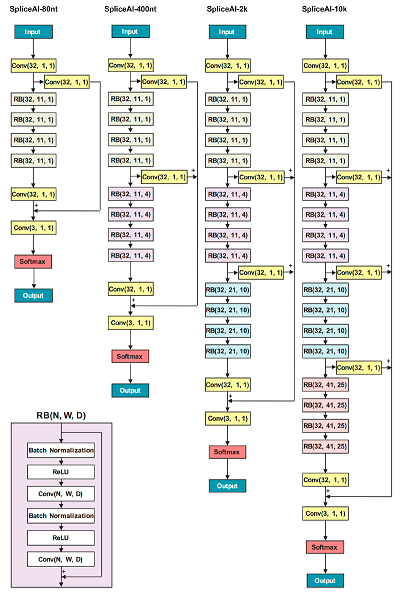

# spliceai-pytorch



Implementation of SpliceAI, Illumina's deep neural network to predict variant effects on splicing, in PyTorch. You can find the Illumina's official implementation [here](https://github.com/Illumina/SpliceAI).

## Installation

```bash
pip install spliceai-pytorch
```

## Usage
```python
from spliceai_pytorch import SpliceAI

```

## Generating train/test sets

First, download 'SpliceAI train code' directory from [here](https://basespace.illumina.com/s/5u6ThOblecrh) and unzip it to `spliceai_train_code` directory.
Also, download human reference genome (version hg19) to `spliceai_train_code/reference` directory.

Then, run the following command to generate train/test sets after moving into `spliceai_train_code/Canonical`.

```bash
chmod 755 grab_sequence.sh
./grab_sequence.sh

# Requires Python 2.7, with numpy, h5py, scikit-learn installed
python create_datafile.py train all  # ~4 miniutes, creates datafile_train_all.h5 (27G)
python create_datafile.py test 0     # ~1 minute, creates datafile_test_0.h5 (2.4G)

python create_dataset.py train all   # ~11 minutes, creates dataset_train_all.h5 (5.4G)
python create_dataset.py test 0      # ~1 minute, creates dataset_test_0.h5 (0.5G)
```